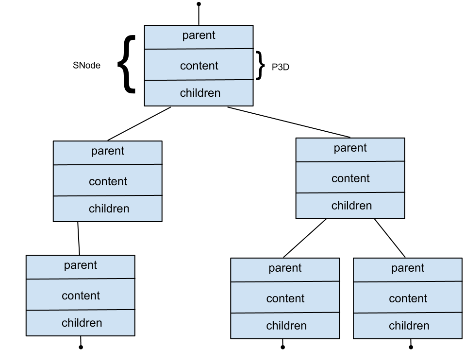

btmorph
=======

Introduction
------------

Small Python library and associated tools to represent and analyze neuronal morphologies. See :ref:`design_requirements` below.

Installation
------------

To run the code, just add the directory containing the files in your PYTHONPATH::

    # in the directory with the *.py files
    export PYTHONPATH=$(pwd):$PYTHONPATH

Test the installation by running the tests:::

    nosetests -v --nocapture tests/tools_test.py
    nosetests -v --nocapture tests/structs_test.py
    nosetests -v --nocapture tests/stats_test.py

Data representation
~~~~~~~~~~~~~~~~~~~

Neurons are essentially tree structures. More precisely, when disregarding the soma, a neuron is a binary tree. That is a tree with at most 2 children at any node. As such, a tree structure provides an intuitive representation of a morphology and can be easily probed to calculate morphometric features.

The tree is implemented as a linked list data structure (STree2). Each item in the list/tree is a node (SNode2) and contains pointers to its parent (``get_parent``) and its children (``get_children``). Each node can store *something* in its designated ``content`` container. By design, the content is a Python dict and in this library it has at least one key: ``'p3d'``, a P3D2 object. Obviously, this tree structure resembles strongly the structure of an SWC file.

Schematically, it looks like this:

.. _design_requirements:

Design requirements
-------------------

Quick and basic assessment of morphometric features of neurons is a must. The internal representation is based on a tree data-structure (rather then an adjacency matrix). Atomic functions are provided to allow usage in scripting and enable the user to built more complex morphometrics on top of the provided functionality. The code is serial because single neuron morphometrics are fast to compute. When analyzing a batch of morphologies a parallel wrapper can be written (e.g., using Pythons's multiprocessing module).

The input is a digital representation of a neuronal morphology in the SWC format. This is the current *de facto* format also used on the curated NeuroMorpho.org database. It is expected to use the standardized SWC-format that follows the three-point soma description (see `here <http://neuromorpho.org/neuroMorpho/SomaFormat.html>`_). For now, the analysis is based on the whole neuron. In case you want to analyze only a part of the morphology, you have to filter the SWC file first and run the analysis on the resulting filtered file.

Morphometrics can be either scalar (= one value per morphology) or vector / distributed (= a distribution of values per morphology). For vector morphometrics, the features can be measures either a branching point, terminal points or both. Other 'points' specified in the SWC file are only used for the internal representation of the geometry.

Morphometric features
~~~~~~~~~~~~~~~~~~~~~

* Scalar: (one per morphological structure under scrutiny)

  * total size: total length of the neurite
  * # stems
  * # branch points
  * # terminal points
  * width (without translation; absolute coordinates; potential extension along the first 3 principal components)
  * height 
  * depth
  * max degree (of neurites sprouting at the soma)
  * max order (of neurites sprouting at the soma)
  * partition asymmetry (can/cannot be measured at the soma?)

* Vector: (per 'point of interest' PoI):

  * segment path length (incoming)
  * segment euclidean length (incoming)
  * contraction (euclidean / path; incoming)
  * order
  * degree
  * partition asymmetry
  * fractal dimension (of path between soma and PoI)
  * `Clouds`: save x,y,z coordinates for post-hoc histograms analysis or other scalar (e.g., moments) or vector properties (e.g., PCA)

Visualization
~~~~~~~~~~~~~

(simple, using matplotlib):

* Dendrogram
* 2D/3D plot 

Quick example
-------------

::

   import btstructs, btstats, btviz
   import numpy
   import matplotlib.pyplot as plt

   swc_tree = btstructs.STree()
   swc_tree.read_SWC_tree_from_file(file_name)
   stats = btstats.BTStats(swc_tree)

   # get the total length
   total_length = stats.total_length()

   # get the max degree, i.e., degree of the soma
   max_degree = stats.degree_of_node(swc_tree.get_root())

   # generate and save the dendrogram
   btviz.plot_dendrogram(file_name=test_file_name)
   plt.savefig('examplar_dendrogram.pdf')
