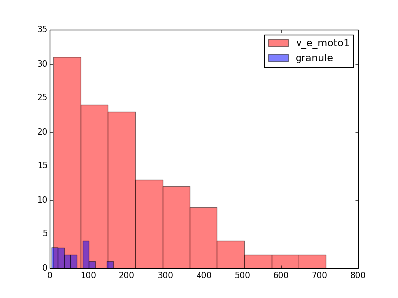

################
btmorph tutorial
################

Brief hands-on introduction to the usage of btmorph to analyze andvalidate neuronal morphometrics data at BBP. A toy algorithm to synthesize neurite morphologies is also described. 

Recommended to use IPython. Open ``ipython --pylab -i`` at the prompt in the ``tutorial`` directory. Then copy and paste code into the python prompt using ``%paste``.

Converting BBP H5(v2) to SWC
----------------------------

The exemplar H5 file is found in the ``tutorial`` directory. The neuron under investigation is a pyramidal cell. To convert the morphology of the complete cell::

  import btmorphtools
  btmorphtools.convert_h5_to_SWC('C060109A3.h5',\
                                 types=[3,4],\
                                 swc_given_name='morph.swc')                                

Or if you want to analyze the apical tree separately. ::  

  import btmorphtools
  btmorphtools.convert_h5_to_SWC('C060109A3.h5',\
                                 types=[4],\
                                 swc_given_name='apical.swc')

You can verify that the files are created in the same directory.                                

Analyzing morphometric data
---------------------------

Once you have an SWC file, you can start analyzing the associated morphology. Stay in the directory where you outputted the ``morph.swc`` file ::

  import btstructs, btstats, btviz
  import numpy
  import matplotlib.pyplot as plt

  swc_tree = btstructs.STree()
  swc_tree.read_SWC_tree_from_file('morph.swc')
  stats = btstats.BTStats(swc_tree)

  """ get the total length, a scalar morphometric feature """
  total_length = stats.total_length()
  print 'Total neurite length=%f' % total_length

  """ get the topological measure of leaf node in the tree"""
  no_terminals = stats.no_terminals()
  print 'Number of terminals=%f' % no_terminals

In case you all do it in one session in ``Ipython``, you don't need to load all libraries all the time and you can just continue to copy and paste code into the prompt.

Now you'll get a vector morphometric, namely the segment length. Clearly, summing all segments lengths together should give us the total segment length as before.::

  bif_nodes = stats._bif_points
  term_nodes = stats._end_points
  all_nodes = bif_nodes +term_nodes
  total_length = 0
  all_segment_lengths = []
  for node in all_nodes :
      all_segment_lengths.append( stats.get_segment_pathlength(node)  )
      total_length = total_length + all_segment_lengths[-1]
  print 'total_length=', total_length

Now you can plot a histogram of the segment length distribution::

  plt.hist(all_segment_lengths)
  plt.xlabel('Segment length (micron)')
  plt.ylabel('count')

which should produce an image as illustrated below:

As a slightly more complicated example, we can also check the path length and Euclidean distance at which bifurcations occur. Plotting the number of bifurcations as a function of euclidean distance is roughly the same as the *Sholl analysis*. ::

  bif_path_lengths = []
  bif_euclidean_lengths = []
  bif_contractions = []
  for node in stats._bif_points :
      bif_path_lengths.append(stats.get_pathlength_to_root(node))
      bif_euclidean_lengths.append(stats.get_Euclidean_length_to_root(node))
      bif_contractions.append( bif_euclidean_lengths[-1] / bif_path_lengths[-1]  )
  plt.hist(bif_euclidean_lengths)
  plt.title('(Almost) Sholl analysis')
  plt.xlabel('euclidean distance (micron)')
  plt.ylabel('count / crossings')

which produces the following image:

Clearly, you can distinguish the bimodal distribution introduced by some the basal and oblique dendrites on the one hand, and the distal apical dendrites on the other.

Finally, to visually inspect both morphologies we could plot them::

  import btviz
  plt.figure()
  btviz.plot_2D_SWC('apical.swc')
  plt.figure()
  btviz.plot_2D_SWC('morph.swc')

.. |apical| image:: figures/apical.png
  :scale: 50

+---------+-----------+
| |full|  | |apical|  |
+---------+-----------+

Potential extensions
^^^^^^^^^^^^^^^^^^^^

There are also hooks in ``btmorph`` to access other features. For instance, it is straight-forward to save a cloud on which measurement related to the spatial distribution of points (for instance the moments) can be measured.::

  bx,by,bz = [],[],[]
  for node in stats._bif_points :
      n = node.get_content()
      bx.append(n.x)
      by.append(n.y)
      bz.append(n.z)
  bif_cloud = [bx,by,bz]
  # save as txt...
  np.savetxt('bif_cloud.txt',bif_cloud) 
  #... or as pickle
  import pickle
  pickle.dump(bif_cloud,open('bif_cloud.pkl','w'))

Note that in this example only bifurcation points are considered. Through the ``STree.get_nodes()`` you can also access data that is neither a bifurcation point (``BTStats._bif_points``) nor a terminal point (``BTStats._end_points``).

The cloud data can now be loaded and plotted (and serve for further analysis)::

  import pickle
  bc = pickle.load(open('bif_cloud.pkl'))
  for i in range(len(bc[0])) :
      plt.plot(bc[0][i],bc[1][i],'ro')

Validation of morphologies
--------------------------

Validation of morphologies boils down, in the simplest 1D case and in a staistical sense, to comparisons of vectors of data. The idea is demonstrated below and can be fairly easily upgraded to conditional (N-dimensional) comparisons using adequate statistical tools.

* One-to-one validation: Two neurons are compared to each other. On a one to one basis there is little statistical ground to compare the scalar properties with each other. However, the vector features (for instance, segment lengths) can be compared.
* Many-to-many validation: A population is compared. In a population with sufficient sample size, we can start comparing the scalar features as well. Simply append all scalar features to a vector for each population and both vectors can be compared. Vector features can be compared by appending the vector of one population (in the 1D case).

1D (or N-dimensional) distributions can be compared with hypothesis testing; a set of tests that assess whether two data distributions are drawn from the same true data source. 

In this example we compare one L5_TTPC1 (from above) with a L6_TPC_L4 one. First convert the l6_ cell::

  import btmorphtools
  btmorphtools.convert_h5_to_SWC('tkb061126a4_ch0_cc2_h_zk_60x_1.h5',\
                                 types=[3,4],\
                                 swc_given_name='l6_tpc_l4.swc')

Then compute some morphometric (for the sake of the example we just compute the segment lengths of all segment coming into a bifurcation point)::

  import btstructs, btstats, btviz
  import numpy
  import matplotlib.pyplot as plt

  l5_tree = btstructs.STree()
  l5_tree.read_SWC_tree_from_file('morph.swc')
  l5_stats = btstats.BTStats(l5_tree)

  l6_tree = btstructs.STree()
  l6_tree.read_SWC_tree_from_file('l6_tpc_l4.swc')
  l6_stats = btstats.BTStats(l6_tree)

  l5_bif_nodes = l5_stats._bif_points
  l6_bif_nodes = l6_stats._bif_points

  l5_bif_segment_lengths = []
  l6_bif_segment_lengths = []
  
  for node in l5_bif_nodes:
      l5_bif_segment_lengths.append( l5_stats.get_segment_pathlength(node)  )
  for node in l6_bif_nodes:
      l6_bif_segment_lengths.append( l6_stats.get_segment_pathlength(node)  )

and compare::

  import scipy
  import scipy.stats
  hist(l5_bif_segment_lengths,color='r',alpha=0.5,label='l5_ttpc1')
  hist(l6_bif_segment_lengths,color='b',alpha=0.5,label='l6_tpc_l4')
  res = scipy.stats.ks_2samp(l5_bif_segment_lengths,l6_bif_segment_lengths)
  print 'K-S=%f, p_value=%f' % (res[0], res[1])

According to the `manual <http://docs.scipy.org/doc/scipy/reference/generated/scipy.stats.kruskal.html#scipy.stats.kruskal>`_: "if the K-S statistic is small or the p-value is high, then we cannot reject the hypothesis that the distributions of the two samples are the same."

Synthesis of neurons
--------------------

Currently, only a `naive` version of Hermann Cuntz' "minimal spanning tree" algorithm (MST) is implemented. 

*MST:* Create a path (without loops, it's a tree!) of minimal length in between of a set of vertices. To create a neuron morphology is has to be adapted for:

* binary trees: dendrites and axons `generally` only have bifurcations.
* The cost is not only the minimum total path length but also the path length to the soma. Thus, cost = total_path + bf x path_to_soma.

Then there are two free parameters: 1. How many `points` to connect, and, 2. the balancing factor bf.

In the naive implementation 1. is set to the same number as in a prototype neuron, i.e., the same number bifurcation points and end points, and 2. is picked by hand. 

*Naive* means here that the algorithm just shakes the existing bifurcation and terminal points by convolving them with a uniform or Gaussian distribution. The result is a unique set of points that is highly similar to the original prototype. As a consequence, you only need to optimize bf to and validate for the total length of the structure. (Which can be done by the simplex method or any other gradient descent-like algorithm).

The implementation is not currently not very fast but the algorithm can connect some 50 points per second.

(Do add the synthesis directory to the `PYTHONPATH`)::

  import mst
  import btviz
  import matplotlib.pyplot as plt
  
  synthesizer = mst.MSTSynth()
  BF=0.1
  tree = synthesizer.from_exemplar_SWC_naive("1208875.CNG.swc",bf=BF,\
                                             out_name="naive_granule.swc",\
                                             seed=0,test=0)
  plt.figure()
  btviz.plot_2D_SWC("N4ttwt.CNG.swc")
  plt.figure()
  btviz.plot_2D_SWC("naive_granule.swc")

which generates the following two plots:

.. |fake| image:: figures/granule_mst.png
  :scale: 50

+---------+---------+
| |real|  | |fake|  |
+---------+---------+

Obviously, some shape parameters are captured by the algorithm (overall spatial embedding) while more detailed parameters are not captured, for instance, the meandering.

Suggested improvements:

* Not naive implementation: construct a density distribution of neuron, sample a number n points from this distribution and connect those. Suggested to use kernel density estimates; once the neurons are aligned around a certain axis, a population can be used to generate the KDEs.
* Meandering: introduce smoothing. Add a little bit of extra meandering / smoothing to the long stretches of dendrite in between of the vertices.
