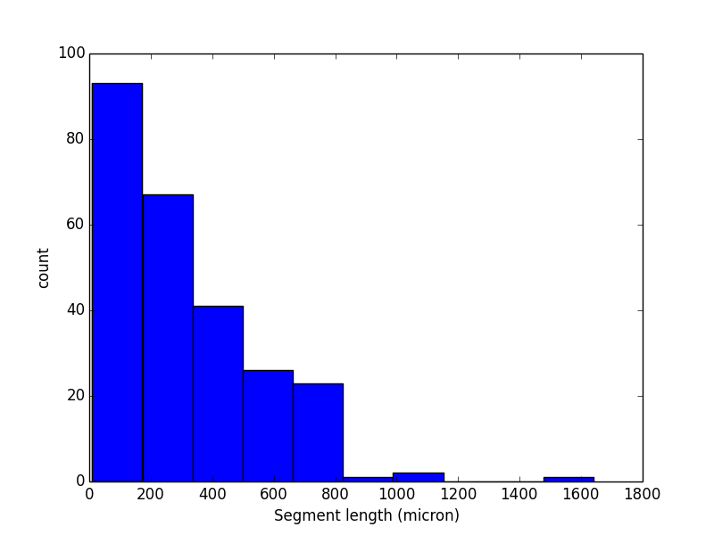
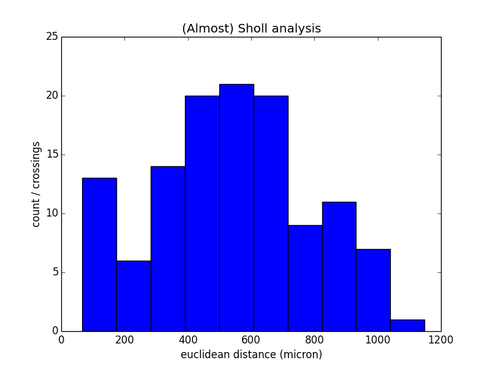
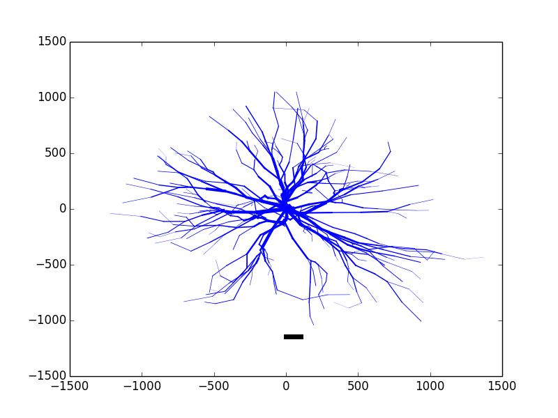
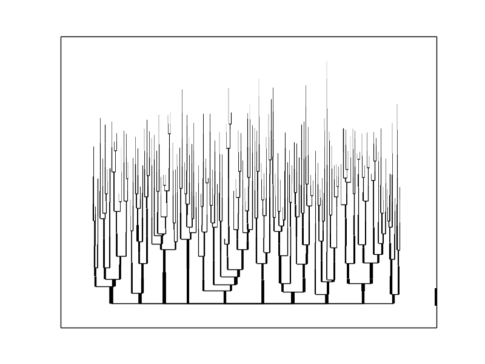
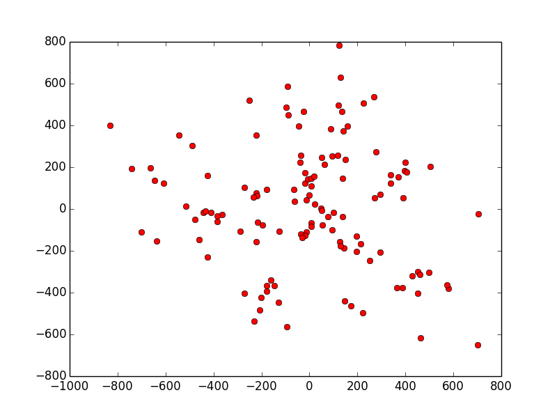
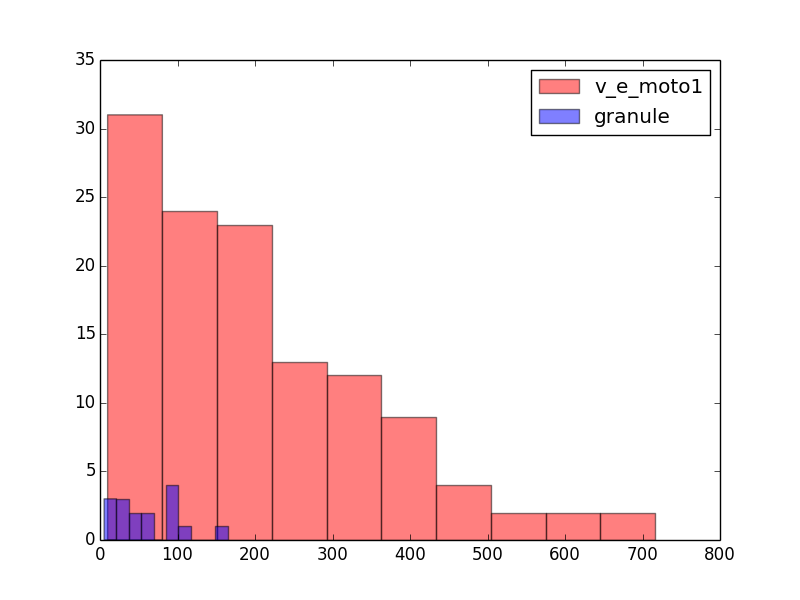

################
Tutorial
################

This is a brief, hands-on tutorial explaining how to use btmorph to load SWC files, analyse them by computing morphometric measures and compare morphologies to one another. A short description is also provided on how to use btmorph in further scripting.

We recommend to use IPython. In a terminal type, change to the :code:`examples` directory and type :code:`ipython --pylab -i`. Then, you can either type the command in the listings below or directly copy them. Copy and pasting of the code snippets can be done by copying them and typing into the ipython prompt :code:`%paste` `(Magic functions) <http://ipython.org/ipython-doc/rel-1.1.0/interactive/tutorial.html>`_.

.. note:: Make use of "magic functions" in IPython. Copy the code from this pages and type ``%paste`` in the IPython session. All code will be pasted with correct layout and directly executed.

Analyzing morphometric data
---------------------------

This tutorial assumes you are in the :code:`examples` directory of the btmorph package (ath the top level, issue :code:`cd examples`). Several exemplar SWC files are contained in the package [#f1]_.
::

  import btmorph
  import numpy
  import matplotlib.pyplot as plt

  swc_tree = btmorph.STree2()
  swc_tree.read_SWC_tree_from_file("data/v_e_moto1.CNG.swc")
  stats = btmorph.BTStats(swc_tree)

  """ get the total length, a scalar morphometric feature """
  total_length = stats.total_length()
  print 'Total neurite length=%f' % total_length

  """ get the topological measure of leaf node in the tree"""
  no_terminals = stats.no_terminals()
  print 'Number of terminals=%f' % no_terminals

In case you do this tutorial in one Ipython session (:code:`Ipython --pylab`), you don't need to load all libraries all the time and you can just continue to copy and paste code into the prompt. Therefore, loading of the library is omitted in the code listing below.

Now probe a vector morphometric, for instance the segment length. Clearly, summing all segments lengths together should give us the total segment length as before.
::

  bif_nodes = stats._bif_points
  term_nodes = stats._end_points
  all_nodes = bif_nodes + term_nodes
  total_length = 0
  all_segment_lengths = []
  for node in all_nodes :
      all_segment_lengths.append( stats.get_segment_pathlength(node)  )
      total_length = total_length + all_segment_lengths[-1]
  print 'total_length=', total_length

Now you can plot a histogram of the segment length distribution::

  plt.hist(all_segment_lengths)
  plt.xlabel('Segment length (micron)')
  plt.ylabel('count')

which should produce an image as illustrated below:

As a slightly more complicated example, we can also check the path length and Euclidean distance at which bifurcations occur. Plotting the number of bifurcations as a function of euclidean distance is roughly the same as the *Sholl analysis*. ::

  bif_path_lengths = []
  bif_euclidean_lengths = []
  bif_contractions = []
  for node in stats._bif_points :
      bif_path_lengths.append(stats.get_pathlength_to_root(node))
      bif_euclidean_lengths.append(stats.get_Euclidean_length_to_root(node))
      bif_contractions.append( bif_euclidean_lengths[-1] / bif_path_lengths[-1]  )
  plt.hist(bif_euclidean_lengths)
  plt.title('(Almost) Sholl analysis')
  plt.xlabel('euclidean distance (micron)')
  plt.ylabel('count / crossings')

which produces the following image:

Clearly, in the above figure we can distinguish the bimodal distribution introduced by some the basal and oblique dendrites on the one hand, and the distal apical dendrites on the other.

Finally, to visually inspect both morphologies we could plot them::

  plt.figure()
  btmorph.plot_2D_SWC("data/v_e_moto1.CNG.swc")
  plt.figure()
  btmorph.plot_dendrogram("data/v_e_moto1.CNG.swc")

+---------+-----------+
| |2D|    | |dendro|  |
+---------+-----------+

Potential extensions
--------------------

There are also hooks in :code:`btmorph` to access other features. 

- ``stats._all_nodes``: list with all nodes in the tree
- ``stats._bif_points``: list with bifurcating nodes in the tree
- ``stats._end_points``: list with terminal (=leaf) nodes in the tree
- ``stats._tree``: STree2 structure. Can be used to compute various graph-theoretical features.

For instance, it is straight-forward to save a cloud on which measurement related to the spatial distribution of points (for instance, the moments of the point cloud) can be measured.::

  bx,by,bz = [],[],[]
  for node in stats._bif_points :
      n = node.get_content()['p3d']
      bx.append(n.xyz[0])
      by.append(n.xyz[1])
      bz.append(n.xyz[2])
  bif_cloud = [bx,by,bz]
  # save as txt...
  np.savetxt('bif_cloud.txt',bif_cloud) 
  #... or as pickle
  import pickle
  pickle.dump(bif_cloud,open('bif_cloud.pkl','w'))

Note that in this example only bifurcation points are considered. Through the ``STree.get_nodes()`` or ``stats._all_points`` all points can be retrieved.

The cloud data can now be loaded and plotted (and serve for further analysis)
::

  import pickle
  bc = pickle.load(open('bif_cloud.pkl'))
  for i in range(len(bc[0])) :
      plt.plot(bc[0][i],bc[1][i],'ro')

Comparison of morphologies
--------------------------

Validation of morphologies boils down -in the simplest one-dimensional case and in a statistical sense- to the comparison of data vectors. The idea is visually illustrated below. The method outlined here can be easily extended to conditional data, that is, N-dimensional data capturing relations between data point using adequate statistical tools.

One-to-one validation
~~~~~~~~~~~~~~~~~~~~~

Two neurons are compared to each other. On a one to one basis there is little statistical ground to compare the scalar properties with each other. However, the vector features (for instance, segment lengths) can be compared. In this example we do the fairly senseless thing of showing the difference between a hippocampal granule cell and a spinal cord motor neuron (used before).
::

  import btmorph
  import numpy
  import matplotlib.pyplot as plt

  v1_tree = btmorph.STree2()
  v1_tree.read_SWC_tree_from_file("data/v_e_moto1.CNG.swc")
  v1_stats = btmorph.BTStats(v1_tree)

  granule_tree = btmorph.STree2()
  granule_tree.read_SWC_tree_from_file("data/1220882a.CNG.swc")
  granule_stats = btmorph.BTStats(granule_tree)

  v1_bif_nodes = v1_stats._bif_points
  granule_bif_nodes = granule_stats._bif_points

  v1_bif_segment_lengths = []
  granule_bif_segment_lengths = []
  
  for node in v1_bif_nodes:
      v1_bif_segment_lengths.append( v1_stats.get_segment_pathlength(node)  )
  for node in granule_bif_nodes:
      granule_bif_segment_lengths.append( granule_stats.get_segment_pathlength(node)  )

And compare the two vectors (visually and by performing the Kruskal-Wallis H-test):
::

  import scipy
  import scipy.stats
  hist(v1_bif_segment_lengths,color='r',alpha=0.5,label="v_e_moto1")
  hist(granule_bif_segment_lengths,color='b',alpha=0.5,label="granule")
  legend(loc=0)
  res = scipy.stats.ks_2samp(v1_bif_segment_lengths,granule_bif_segment_lengths)
  print 'K-S=%f, p_value=%f' % (res[0], res[1])

A figure will be generated and the output will appear: ``K-S=0.609631, p_value=0.000023``

According to the `manual <http://docs.scipy.org/doc/scipy/reference/generated/scipy.stats.kruskal.html#scipy.stats.kruskal>`_: "if the K-S statistic is small or the p-value is high, then we cannot reject the hypothesis that the distributions of the two samples are the same."

Many-to-many validation
~~~~~~~~~~~~~~~~~~~~~~~

The comparison of two population can be done in exactly the same way as described above. The scalar properties of each neuron in the population make up a vector of values. Hence, the vector of one population can be compared against the vector associated with another population. In the case of vector features, all features can be appended to one vector per population.

Wrappers for btmorph
--------------------

We provide basic wrappers that perform standard, of-the-shelf analysis of neurons. Two wrappers are available.

- ``btmorph.perform_2D_analysis``. Collects morphometric features of birufcatiuon and terminal points and stores the results in files. For each of these points the path length to the soma, euclidean distance from the soma, degree, order, partition asymmetry and segment length are recorded. Hence, one can correlate, for instance, the segment length with the centrifugal order (= two-dimensional). Higher order correlation can be used at will as well. (See API)

- ``btmorph.perform_1D_population_analysis``. Collects all morphometric features of one population in vectors and writes the result to files. (see API)

References

.. [#f1] v_e_moto1 is downloaded from `here <http://neuromorpho.org/neuroMorpho/neuron_info.jsp?neuron_name=v_e_moto1>`_ and originates from a study linked on `pubmed <http://www.ncbi.nlm.nih.gov/pubmed/3819010>`_.
