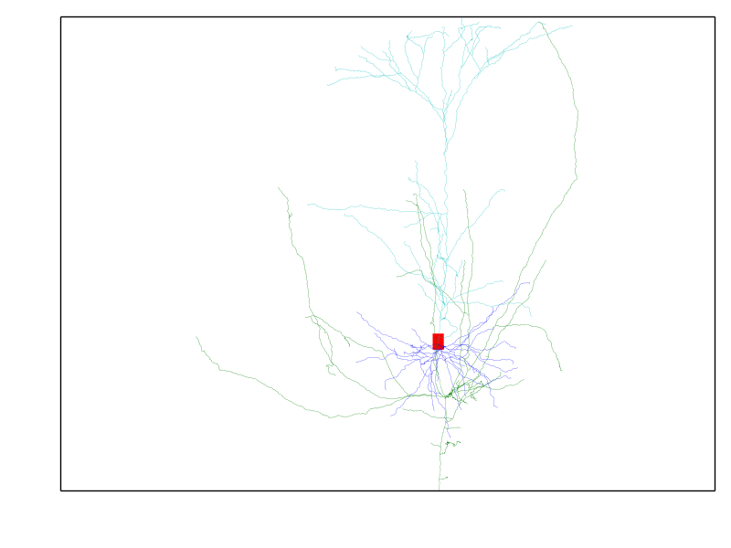
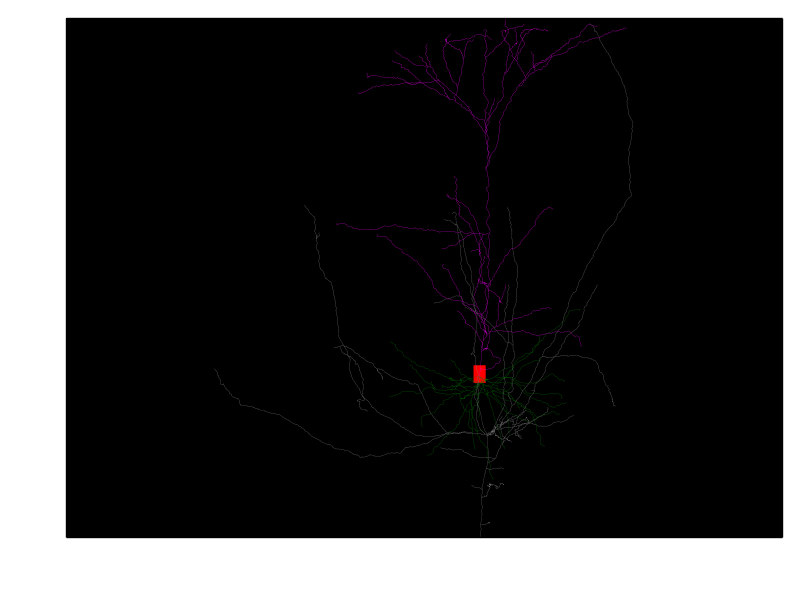
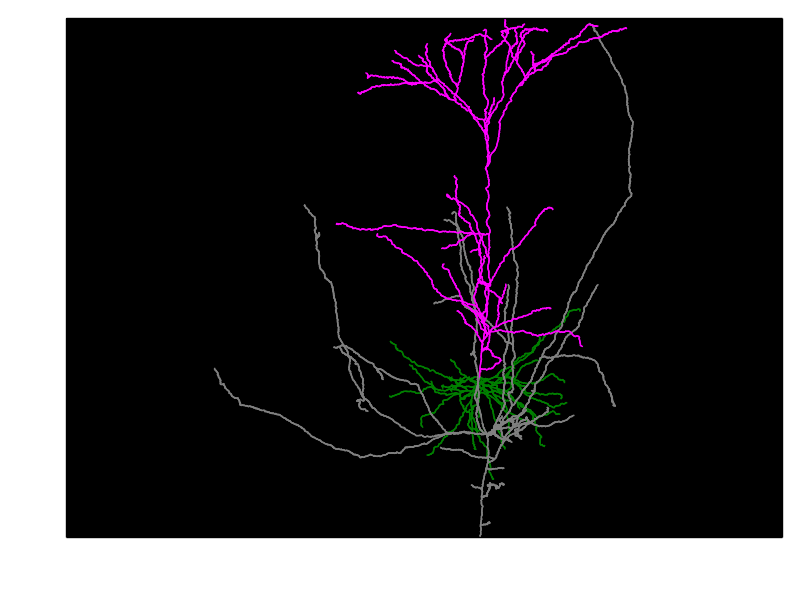
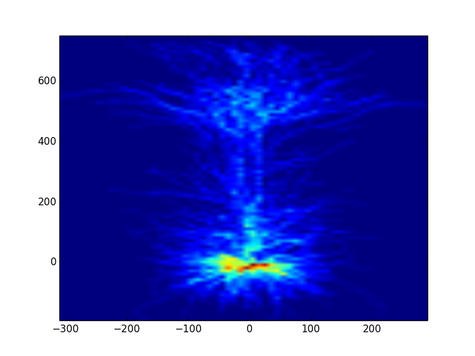
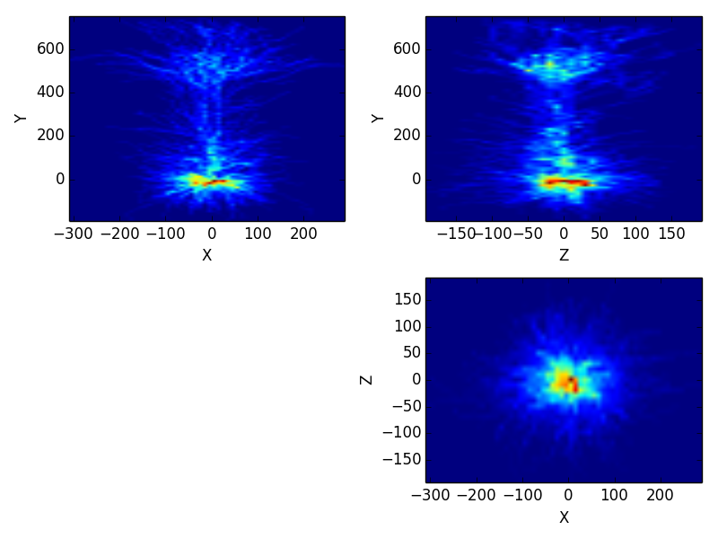

################
Visualization
################

Visualization is highly customizable in btmorph; mainly because you can access the data directly and subsequently use all available Python tools to visualize the data. Visualizing a neurite boils down to looping over all nodes in the tree and plotting a line between the current node and its parent. As such, end user can implement their own visualization quickly and efficiently. 

In addition to the "DIY" method, btmorph also contains several wrappers to quickly generate some standard visualizations of neurites. Below we illustrate a few of them. please consult the API for more details about the visualization wrappers. All wrapper use standard Matplotlib functionality. 

.. note:: One morphology is used in this tutorial. A L5 pyramidal neuron from the Kawaguchi archive and downloaded from `NeuroMorpho.org <http://neuromorpho.org/neuroMorpho/neuron_info.jsp?neuron_name=CTh5080306F>`_. With the function `filter_and_save_SWC` we obtained "filtered" versions only contain the basal and apical trees. These data files can be found in the folder `examples/data`.

2D plotting
-----------

Basic 2D plotting is provided; a straightforward projection onto the XY plane is performed. First, we set up some of the files for later use. This tutorial assumes you are in the :code:`examples` directory of the btmorph package (ath the top level, issue :code:`cd examples`).
::
   full_fn = "data/CTh5080306F.CNG.swc"
   basal_fn = "data/CTh5080306F.CNG_filtered_basal.swc"
   apical_fn = "data/CTh5080306F.CNG_filtered_apical.swc"

Then, to plot the data with two different color schemes; a default one and the one used by `NeuroMorpho.org <http://www.neuromorpho.org>`_, execute the following command:
::
   import btmorph
   btmorph.plot_2D_SWC(full_fn,show_axis=False,color_scheme='default',depth='Y')

With this command not axis are drawn (`show_axis=False`), the default color scheme is used (`color_scheme='default'`) and the Y axis, which is used to set the depth, corresponds to the Y-axis used in the SWC file (`depth='Y'`). The color scheme and depth argument are redundant here because they are the defaults; calling the same function without them would produce the same figure. The resultant figure is shown below.

A slight variation is shown below and uses the `color_scheme='neuromorpho'`. But because thing neurites are hardly visible, it is better to draw a wire plot in which all neurites have the same diameter.
::
   btmorph.plot_2D_SWC(full_fn,show_axis=False,color_scheme='neuromorpho')
   btmorph.plot_2D_SWC(full_fn,show_axis=False,color_scheme='neuromorpho',show_radius=False)

+---------+-----------+
| |nm|    | |nm_wire| |
+---------+-----------+

.. note:: Plots can be either saved by using the interactive command in Ipython: `savefig('name.extension')`, but see `here <http://matplotlib.org/api/pyplot_api.html#matplotlib.pyplot.savefig>`_ for more info about the `savefig` command. Another option in btmorph is to provide the `outN` argument. The value of this argument has to be a string `name.extension`; either the full path can be included or otherwise the figure will be saved in the current working directory.

A nice way to visualize variation in a set of morphologies is by plotting a spatial density of the neurites. In btmorph this can be achieved by the population_2D_density_projections. 
::
   import btmorph
   btmorph.population_density_projection(destination='data/pyr_pop/', \
      filter='*.swc', outN="data/pyr_pop/density.png", precision=[10, 10, 10],depth='Y')

Pseudo 3D plotting
------------------

A similar pseudo 3D version is also available for the density plot.
::
   import btmorph
   btmorph.population_2D_density_projections(destination='data/pyr_pop/', \
      filter='*.swc', outN="data/pyr_pop/density.png", precision=[10, 10, 10])

3D plotting
-----------
